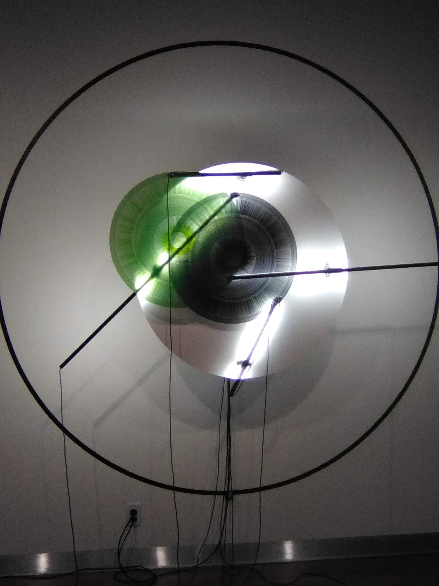
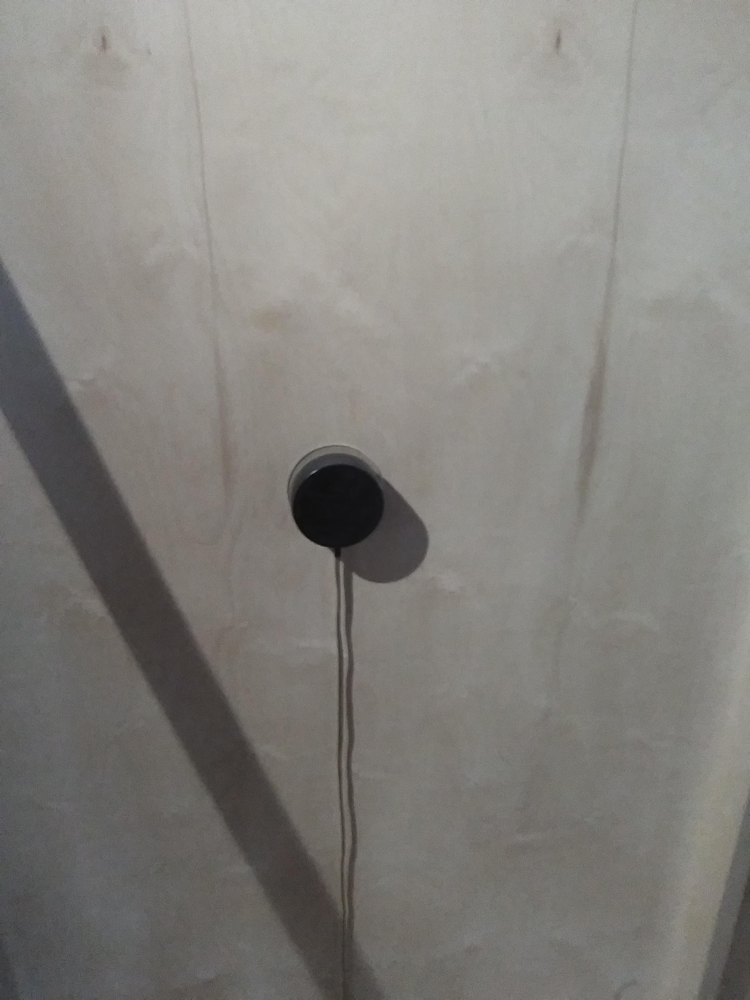

# Présentation sur l'oeuvre l'en deçà de la configuration du sensible 
## 2019-2021

## Intervenants/Artistes
### Sabin Hudon
### Catherine Béchard 
### Aseman Sabet

## Nom événement
### Exposition : Béchard Hudon - Configurations du sensible

## Lieu de mise en exposition
### la Maison des Arts de Laval

## Date de visite
### 16 mars 2022

## Description de l'oeuvre (2022)
### C'est une grande structure en bois qui permet d'interagir avec le public à travers de sons émis de la structure. Des sons provenant de la nature  recherchés par les créateurs de l'oeuvre.  

## Explication sur la mise en place

### Dans la place, il se trouve plusieurs oeuvres organisées de façon particulière. Une sorte d'écran projetant des images confusantes ressemblant à une rivière ou un lac. Une structure bois émettant des divers types de sons reliés à l'image. 

## Liste des éléments nécessaires pour la mise en exposition 
### Amplificateur: qui permet de émettre le son de façon plus condensé.

## Expérience vécue
### Je trouve vraiment que le projet est très original, je vois rarement un type de projet de cette envergure. C'est vraiment un projet intéressant et montre les efforts que les créateurs ont accomplit pour le faire. Le fait d'aller chercher dans la nature des sons nécessaires pour la réalisation de l'oeuvre est vraiment une preuve de dédication de leur part. L'oeuvre est vraiment immersif et intéressant qui permet aux visiteur comme toi de faire parti de l'oeuvre.
### Référence
### https://www.laval.ca/Pages/Fr/Calendrier/mda-expo-bechard-hudon.aspx#:~:text=L'exposition%20Configurations%20du%20sensible,structure%20en%20bois%20aux%20consonances
