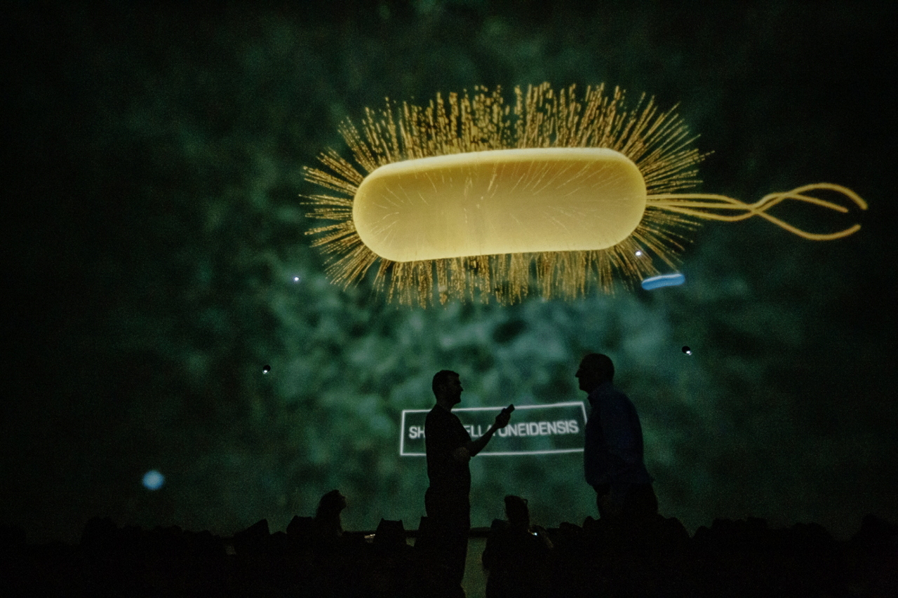
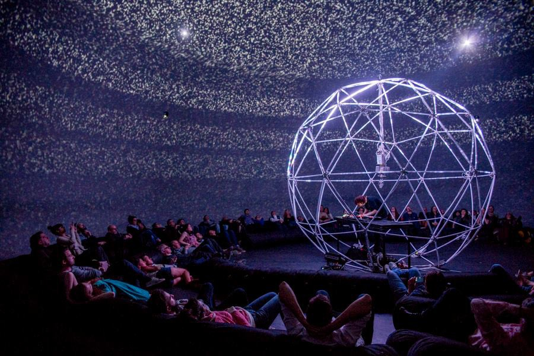
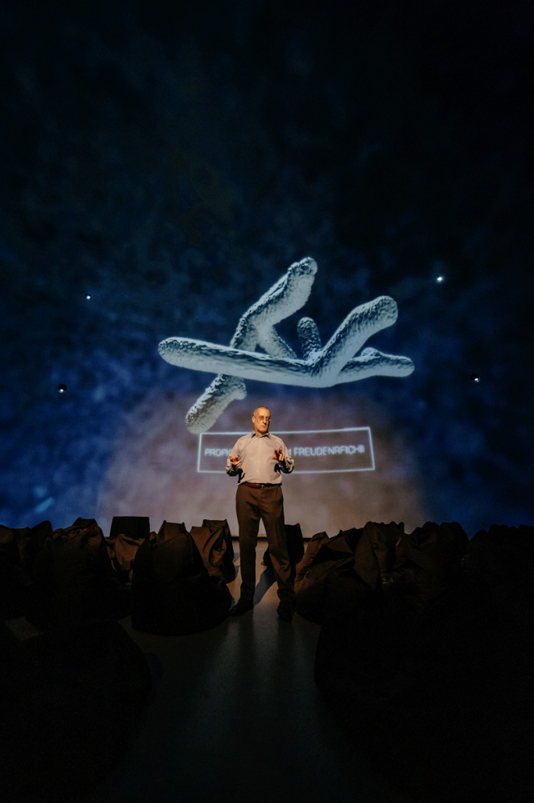
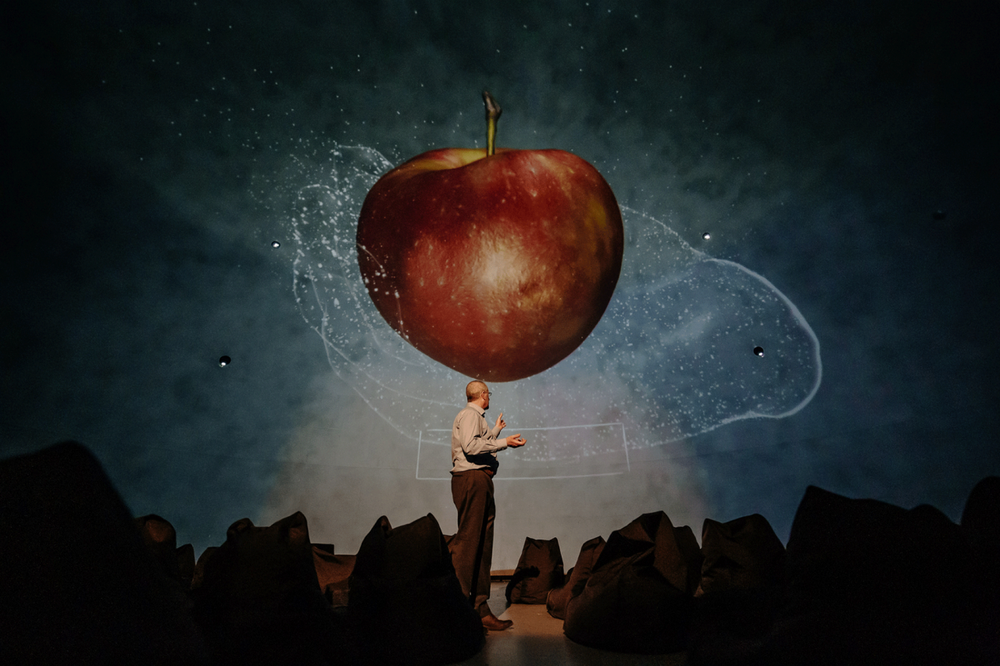
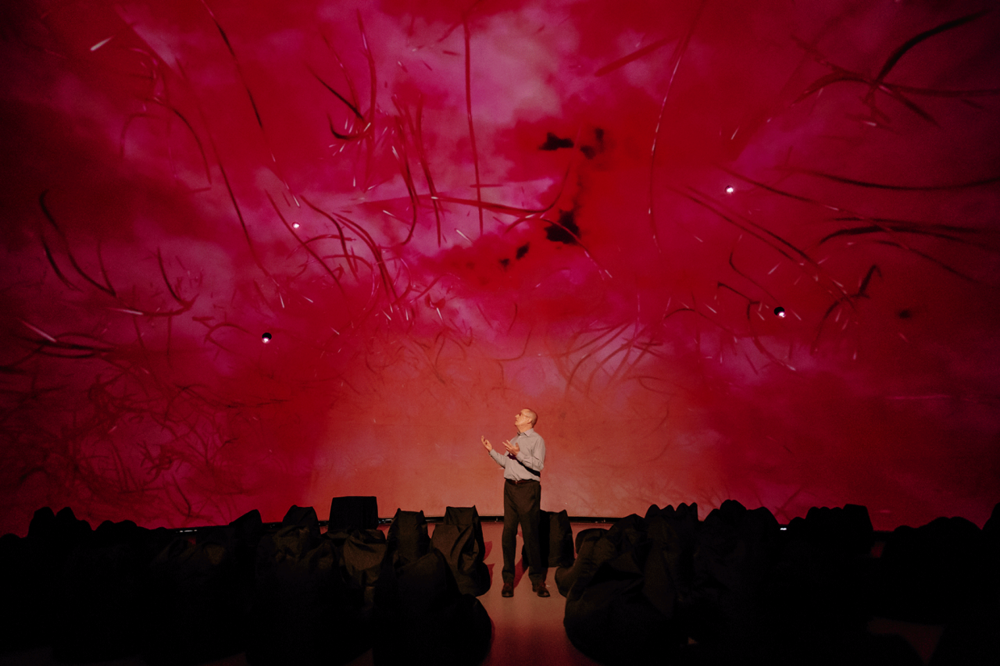
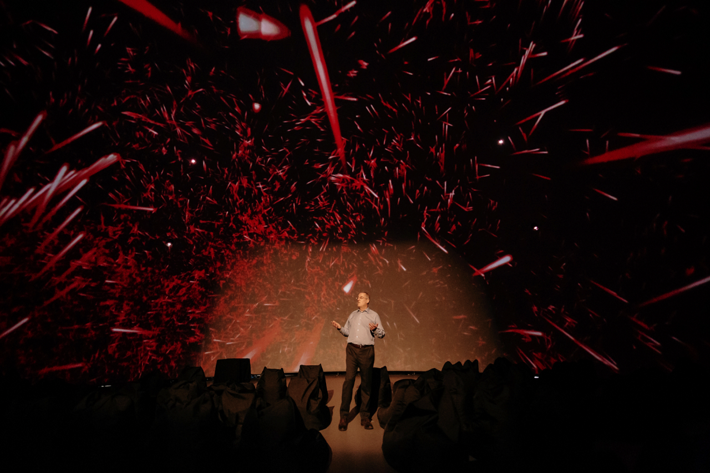
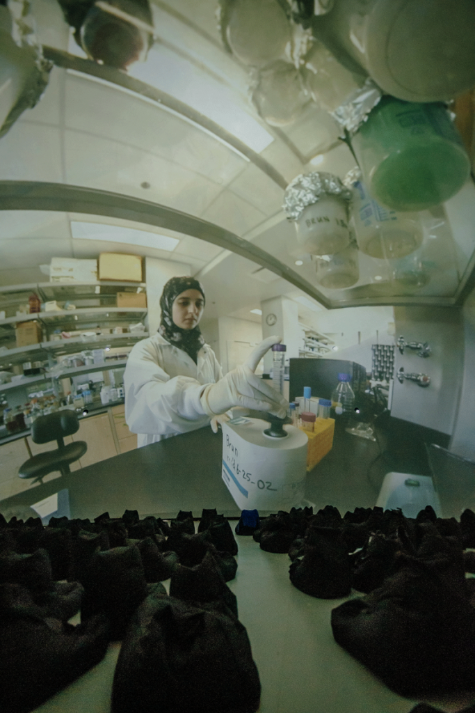

# La conférence immersive sur la poésie des bactéries
## 2020-2022

### Professeur et rechercheur: Yves Brun

### Conférence immersive sur la poésie des bactéries

### La Société des Arts et Technologie, statosphère

### Visitée le 19 avril 2022

## Description de l'oeuvre

### C'est la conférence de Yves Brun chercheur et professeur qui parle de l’histoire de la découverte des bactéries, leurs rôles dans la nature et chez l’humain, et l’importance de la recherche fondamentale. L’événement met aussi en place la curiosité du chercheur, ses techniques sophistiquées de microscopie, son laboratoire bouillonnant d’activité, son projet de science participative et sa lutte contre l’antibiorésistance. 

## Explication sur la mise en place

### 
Dans l'espace il y avait des coussins pour permettre aux gens de s'assoir et un écran qui affichait des projections.
## Liste des composantes et techniques de l'oeuvre ou du dispositif 

###

## Liste des éléments nécessaires pour la mise en exposition 

## Expérience vécue

### J'ai vraiment apprécié ce projet car je ne m'y attendais pas. J'étais y aller en ayant des très peu d'attentes envers cette conférence car c'était le dernier projet qu'il restait de disponible mais j'ai finalement vraiment apprécié. Je me sentais transporté dans l'univers microscopiques des bactéries. Les projetctions étaient fluides et de bonnes qualité, Yves Brun avait une bonne élocution quand il faisait sa conférence et m'aidais vraiment à comprendre les informations sur les bactéries. À un moment donné, durant il a affiché une projection vidéo prise par une caméra 360 degré. Et ça m'a vraiment donné une idée pour un projet. Les détails étaient vraiment précise et la vue 360 est vraiment impressionante. S'il y a un aspect que j'améliorais ça serait les projections sonores que je ne trouvaient pas assez fortes et cela m'enlevais parfois de l'expérience que je vivais. Car j'arrivais à entendre les bruits extérieurs. 

### Référence
## sources
https://sat.qc.ca/fr/evenements/la-poesie-des-bacteries
https://sat.qc.ca/albums/la-poesie-des-bacteries
