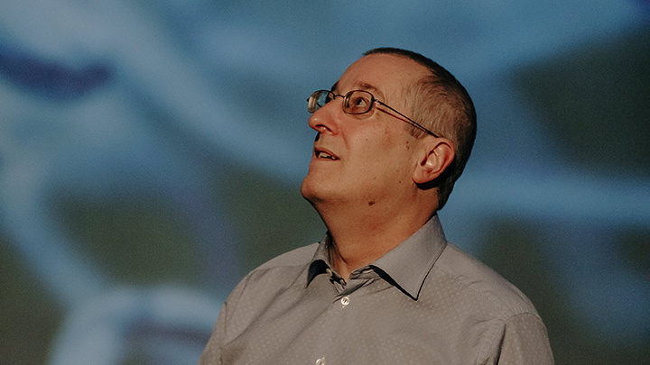

# La conférence immersive sur la poésie des bactéries
## 2020-2022

### Professeur et rechercheur: Yves Brun

### Conférence immersive sur la poésie des bactéries

### La Société des Arts et Technologie, statosphère

### Visitée le 19 avril 2022

## Description de l'oeuvre
###

## Explication sur la mise en place
###

## Liste des composantes et techniques de l'oeuvre ou du dispositif 
###

### Liste des éléments nécessaires pour la mise en exposition 
##

### Expérience vécue
##

### Référence
